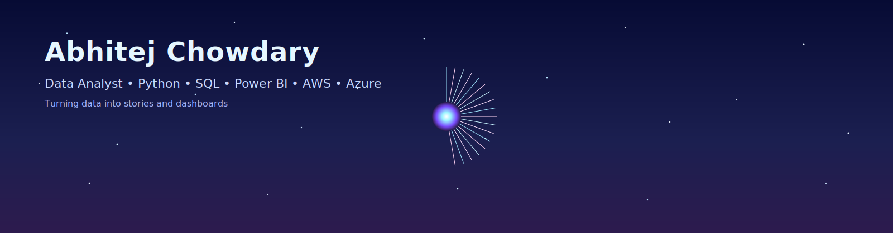
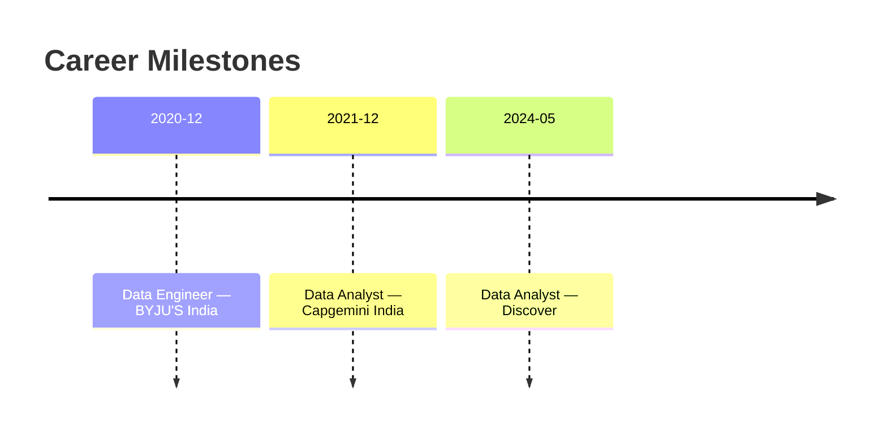

<!-- Cosmic, lively, animated profile README for Abhitej -->

  

  
  
  

  

---

### 🛰️ About Me
- 📍 Chicago, IL
- 🧠 Data Analyst with **4+ years** in Business Analytics, Decision Support & BI.
- ⚙️ I build **automated dashboards**, **forecasting models**, and **ETL pipelines** across **Python, SQL, Power BI, Snowflake, AWS, Azure & BigQuery**.
- 🌌 I love clean visuals, fast refresh rates, and meaningful KPIs.

> Recent wins: +12% retention via churn modeling, 35% less manual reporting, 20% faster refreshes, 30% better forecast accuracy.

---

### 🌠 Tech Constellation

  
  
  
  
  
  
  
  
  
  

- **Data Science**: Regression · Classification · Clustering · Time Series
- **Viz & BI**: Power BI (DAX, Report Builder) · Tableau · Matplotlib
- **Data Stack**: MySQL · PostgreSQL · SQL Server · Snowflake · Denodo
- **Pipelines**: ADF · Databricks · Python (ETL, validation) · Azure Functions
- **Extras**: A/B Testing · Data Quality · KPI Design · FP&A reporting

---

### 🚀 Impact Highlights
- **Discover (May 2024 – Present)** — Automated **Power BI + SQL** dashboards for sales & marketing KPIs; built **forecasting models in Python**; **+12% retention** via churn analysis; **35%** manual effort reduction; **20%** faster refresh; **30%** better forecast accuracy.  
- **Capgemini India (Dec 2021 – Dec 2022)** — Automated Excel/Power BI reports (**–40%** effort); built Tableau dashboards for leadership; validated SQL/BI reports; prepared board-ready financial decks.  
- **BYJU’S India (Dec 2020 – Dec 2021)** — Designed **PySpark** and Azure ETL; **–15%** runtime; **–25%** manual work via automation; built finance/utilization dashboards in Power BI.

---

### 🌌 Dashboard Gallery (drop your screenshots to `assets/`)
| Finance Trends (Power BI) | Churn Explorer (Python + Power BI) | Forecast Studio (DAX + Python) |
|---|---|---|
|  |  |  |

> Tip: Add real screenshots/GIFs of your dashboards to `assets/` and they’ll render here.

---

### 📈 GitHub Cosmos

  
  

  

  

---

### 🗺️ Career Timeline

---

### 📬 Contact
- ✉️ **abhitej3718@gmail.com**
- 🔗 **LinkedIn:** [nidadavolu-abhitejchowdary](https://www.linkedin.com/in/nidadavolu-abhitejchowdary)
- 📍 Chicago, IL
<!-- Optional: 📞 331-226-6459 -->

---

Made by abhitej, and lots of data.
